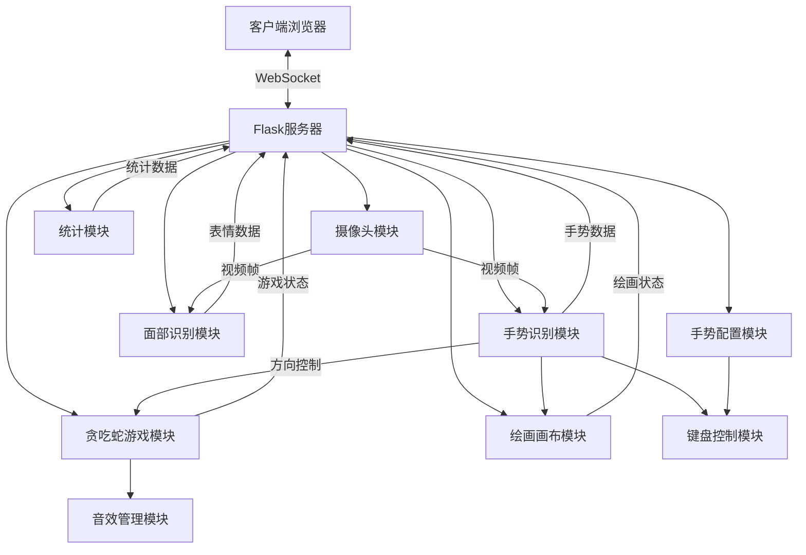

# 手势识别互动系统 (Now You See Me)

一个基于计算机视觉的手势识别互动系统，支持手势识别、面部表情识别以及手势控制贪吃蛇游戏。

## 功能特性

- **实时手势识别**：识别多种手势，如握拳、张开手掌、指向等
- **面部表情识别**：检测微笑和眨眼等面部表情
- **特效模式**：支持"黑客帝国"风格的视觉特效
- **贪吃蛇游戏**：使用食指方向控制贪吃蛇移动
- **统计分析**：记录和分析手势和表情的使用频率
- **音效系统**：游戏中的各种动作配有音效
- **手势配置**：自定义每种手势对应的功能，如键盘快捷键、媒体控制等
- **手势绘画**：使用手指在空中绘画，支持选择不同手指进行绘画

## 系统架构



## 模块说明

- **Camera**: 摄像头模块，负责捕获视频流
- **GestureRecognizer**: 手势识别模块，使用MediaPipe进行手部检测和手势识别
- **FaceRecognizer**: 面部识别模块，负责识别面部表情如微笑和眨眼
- **SnakeGame**: 贪吃蛇游戏模块，使用食指控制蛇的移动方向
- **StatsTracker**: 统计模块，记录和分析手势和表情的使用频率
- **SoundManager**: 音效管理模块，负责加载和播放游戏音效
- **KeyboardController**: 键盘控制模块，负责将手势转换为键盘操作
- **GestureConfig**: 手势配置模块，管理手势与功能的映射关系
- **DrawingCanvas**: 绘画画布模块，实现手势绘画功能

## 技术栈

- **后端**: Flask, Flask-SocketIO
- **计算机视觉**: OpenCV, MediaPipe
- **前端**: HTML, CSS, JavaScript, Socket.IO
- **游戏引擎**: Pygame (后端渲染)
- **日志系统**: Rich (美化终端输出)

## 安装说明

### 环境要求

- Python 3.8+
- 摄像头设备

### 安装步骤

1. 克隆仓库
   ```bash
   git clone https://github.com/yourusername/NowYouSeeMe.git
   cd NowYouSeeMe
   ```

2. 安装依赖
   ```bash
   pip install -r requirements.txt
   ```

3. 创建默认音效文件（如果需要）
   ```bash
   python create_default_sounds.py
   ```

4. 启动应用
   ```bash
   python app.py
   ```

5. 在浏览器中访问
   ```
   http://localhost:8080
   ```

## 使用方法

### 主界面

1. 点击"启动摄像头"按钮开始视频流
2. 使用"开启黑客帝国特效"按钮切换视觉特效
3. 使用"开启面部识别"按钮启用面部表情识别
4. 使用"开启手势快捷键"按钮启用手势控制功能
5. 点击"手势配置"进入手势配置页面
6. 点击"手势绘画"进入绘画页面
7. 点击"贪吃蛇游戏"进入游戏模式

### 手势配置

1. 在手势配置页面，可以为每种手势设置对应的功能
2. 支持的功能类型包括：
   - 无动作
   - 键盘快捷键（如复制、粘贴、撤销等）
   - 媒体控制（如播放/暂停、音量调节等）
   - 应用控制（如切换应用、新建标签页等）
   - 自定义函数（如截屏、屏幕录制等）
3. 设置完成后点击"保存"按钮保存配置
4. 点击"重置所有配置"按钮可恢复默认设置

### 手势绘画

1. 点击"启动摄像头"按钮开始视频流
2. 使用选定的手指（默认为食指）在空中绘画
3. 当食指和中指分开时开始绘画，靠近时停止绘画
4. 可以选择不同的颜色和画笔大小
5. 支持橡皮擦功能、清空画布、撤销操作和保存图片
6. 可以在"选择绘画手指"区域选择使用哪根手指进行绘画（拇指、食指、中指、无名指、小指）

### 贪吃蛇游戏

1. 使用食指指向不同方向控制蛇的移动
2. 手势"握拳"可以暂停/继续游戏
3. 手势"OK"可以重新开始游戏
4. 点击"开启/关闭音效"按钮控制游戏音效

## 支持的手势

- 握拳
- 张开手掌
- 点赞（拇指向上）
- 剪刀手（食指和中指伸展）
- 指向（只有食指伸展）
- 放大（双手分开）
- 缩小（双手靠近）

## 支持的面部表情

- 微笑
- 眨眼
- 更多表情...

## 日志系统

系统自动在`logs`目录下生成日志文件，按模块和日期分类：
- `app_YYYYMMDD.log`
- `camera_YYYYMMDD.log`
- `gesture_YYYYMMDD.log`
- `face_YYYYMMDD.log`
- `snake_game_YYYYMMDD.log`
- `stats_YYYYMMDD.log`
- `sound_YYYYMMDD.log`
- `keyboard_YYYYMMDD.log`
- `gesture_config_YYYYMMDD.log`
- `drawing_YYYYMMDD.log`

## 统计数据

系统会自动记录手势和表情的使用频率，并在`stats`目录下保存统计数据。

## 配置数据

系统会在`config`目录下保存手势配置数据，文件名为`gesture_config.json`。

## 绘画作品

系统会在`drawings`目录下保存绘画作品，文件名格式为`drawing_YYYYMMDD_HHMMSS.png`。

## 许可证

MIT

## 贡献指南

欢迎提交问题和拉取请求！

## 致谢

- MediaPipe团队提供的出色的计算机视觉库
- Flask和Socket.IO团队提供的实时通信框架 